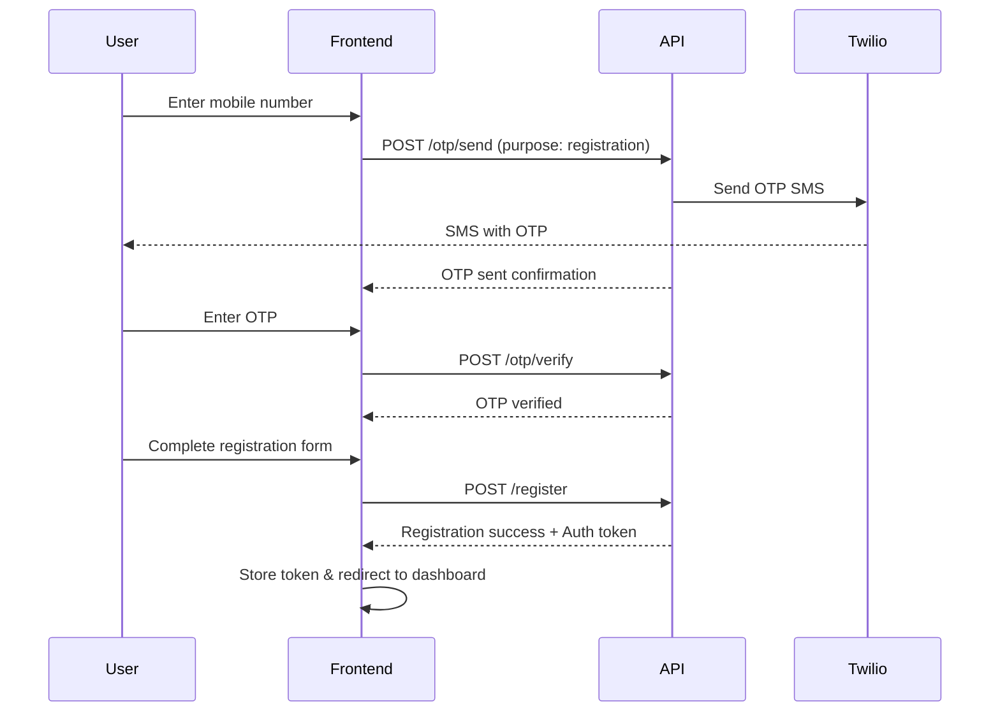
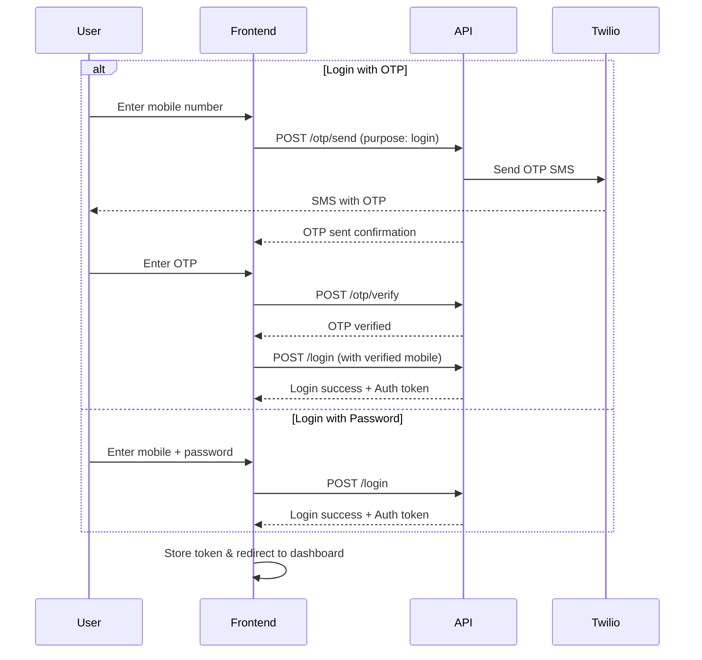

# OTP-Based User Authentication API Documentation
## Mobile Login & Registration for Frontend Implementation

---

## Overview
This documentation provides complete API endpoints for implementing mobile-based user authentication using OTP (One-Time Password). It includes both registration and login flows for users.

**Base URL:** `{APP_URL}/api/v1`

**Authentication Type:** Bearer Token (after successful login/registration)

---

## Table of Contents
1. [User Registration with Mobile OTP](#1-user-registration-with-mobile-otp)
2. [User Login with Mobile OTP](#2-user-login-with-mobile-otp)
3. [Complete Registration Flow](#complete-registration-flow)
4. [Complete Login Flow](#complete-login-flow)
5. [Error Handling](#error-handling)
6. [Frontend Implementation Examples](#frontend-implementation-examples)

---

## 1. User Registration with Mobile OTP

### Step 1: Send OTP for Registration

**Endpoint:** `POST /otp/send`

**Description:** Sends OTP to mobile number for registration verification.

**Request Headers:**
```http
Content-Type: application/json
Accept: application/json
```

**Request Body:**
```json
{
  "mobile_code": "+20",
  "mobile": "1234567890",
  "purpose": "registration"
}
```

**Parameters:**

| Parameter    | Type   | Required | Description                          |
|-------------|--------|----------|--------------------------------------|
| mobile_code | string | Yes      | Country code (e.g., "+1", "+20")    |
| mobile      | string | Yes      | Mobile number without country code   |
| purpose     | string | Yes      | Must be "registration"               |

**Success Response (200):**
```json
{
  "status": "success",
  "message": ["OTP sent successfully to your mobile number."],
  "data": {
    "full_mobile": "+201234567890",
    "expires_in_minutes": 10,
    "otp_id": 123
  }
}
```

**Error Response (400) - Rate Limited:**
```json
{
  "status": "error",
  "message": ["Please wait 45 seconds before requesting a new OTP."],
  "data": {
    "wait_seconds": 45
  }
}
```

---

### Step 2: Verify OTP

**Endpoint:** `POST /otp/verify`

**Description:** Verifies the OTP entered by the user before registration.

**Request Body:**
```json
{
  "mobile_code": "+20",
  "mobile": "1234567890",
  "otp": "123456",
  "purpose": "registration",
  "user_type": "user"
}
```

**Parameters:**

| Parameter    | Type   | Required | Description                          |
|-------------|--------|----------|--------------------------------------|
| mobile_code | string | Yes      | Country code                         |
| mobile      | string | Yes      | Mobile number without country code   |
| otp         | string | Yes      | 6-digit OTP received via SMS         |
| purpose     | string | Yes      | Must be "registration"               |
| user_type   | string | No       | "user" or "vendor" (default: "user") |

**Success Response (200):**
```json
{
  "status": "success",
  "message": ["Mobile number verified successfully."],
  "data": {
    "full_mobile": "+201234567890",
    "verified_at": "2025-10-28 12:30:45"
  }
}
```

**Error Response (400) - Invalid OTP:**
```json
{
  "status": "error",
  "message": ["Invalid OTP. Please try again."],
  "data": {
    "remaining_attempts": 2
  }
}
```

---

### Step 3: Complete Registration

**Endpoint:** `POST /register`

**Description:** Completes user registration after OTP verification.

**Request Body:**
```json
{
  "firstname": "John",
  "lastname": "Doe",
  "mobile_code": "+20",
  "mobile": "1234567890",
  "email": "john.doe@example.com",
  "password": "SecurePass123!",
  "country": "Egypt",
  "agree": "on"
}
```

**Parameters:**

| Parameter    | Type   | Required | Description                                    |
|-------------|--------|----------|------------------------------------------------|
| firstname   | string | Yes      | User's first name (max 60 characters)          |
| lastname    | string | Yes      | User's last name (max 60 characters)           |
| mobile_code | string | Yes      | Country code (must match verified mobile)      |
| mobile      | string | Yes      | Mobile number (must match verified mobile)     |
| email       | string | No       | Email address (optional for mobile registration)|
| password    | string | Yes      | Password (min 6 characters, or 8 with complexity if secure password enabled) |
| country     | string | Yes      | Country name                                   |
| refer       | string | No       | Referral ID (if applicable)                    |
| agree       | string | Yes*     | "on" - Agreement to terms (*if required in settings) |

**Success Response (200):**
```json
{
  "status": "success",
  "message": ["User successfully registered"],
  "data": {
    "token": "eyJ0eXAiOiJKV1QiLCJhbGc...",
    "user_info": {
      "id": 123,
      "firstname": "John",
      "lastname": "Doe",
      "fullname": "John Doe",
      "username": "john-doe",
      "email": "john.doe@example.com",
      "mobile_code": "+20",
      "mobile": "1234567890",
      "full_mobile": "+201234567890",
      "email_verified": true,
      "kyc_verified": false,
      "two_factor_verified": false,
      "two_factor_status": false,
      "two_factor_secret": null
    },
    "authorization": {
      "status": false,
      "token": ""
    }
  }
}
```

**Error Response (400) - User Already Exists:**
```json
{
  "status": "error",
  "message": ["User already exists!"],
  "data": []
}
```

**Error Response (422) - Validation Error:**
```json
{
  "status": "error",
  "message": [
    "The mobile field is required.",
    "The mobile has already been taken."
  ],
  "data": []
}
```

---

## 2. User Login with Mobile OTP

### Step 1: Send OTP for Login

**Endpoint:** `POST /otp/send`

**Description:** Sends OTP to registered mobile number for login.

**Request Body:**
```json
{
  "mobile_code": "+20",
  "mobile": "1234567890",
  "purpose": "login"
}
```

**Parameters:**

| Parameter    | Type   | Required | Description                          |
|-------------|--------|----------|--------------------------------------|
| mobile_code | string | Yes      | Country code                         |
| mobile      | string | Yes      | Registered mobile number             |
| purpose     | string | Yes      | Must be "login"                      |

**Success Response (200):**
```json
{
  "status": "success",
  "message": ["OTP sent successfully to your mobile number."],
  "data": {
    "full_mobile": "+201234567890",
    "expires_in_minutes": 10,
    "otp_id": 124
  }
}
```

---

### Step 2: Verify OTP and Login

**Endpoint:** `POST /otp/verify`

**Description:** Verifies OTP and returns user session information.

**Request Body:**
```json
{
  "mobile_code": "+20",
  "mobile": "1234567890",
  "otp": "123456",
  "purpose": "login",
  "user_type": "user"
}
```

**Success Response (200):**
```json
{
  "status": "success",
  "message": ["Mobile number verified successfully."],
  "data": {
    "full_mobile": "+201234567890",
    "verified_at": "2025-10-28 13:45:20"
  }
}
```

---

### Optional: Single-call Verify + Login endpoint

If you'd prefer a single API call that verifies the OTP and returns an auth token in one step, we've added a dedicated endpoint:

**Endpoint:** `POST /otp/login-via-otp`

**Description:** Verifies the OTP (purpose=login) and, on success, issues a Passport access token for the user (OTP-only login).

**Request Body:**
```json
{
  "mobile_code": "+20",
  "mobile": "1234567890",
  "otp": "123456",
  "user_type": "user"
}
```

**Success Response (200):**
```json
{
  "status": "success",
  "message": ["OTP verified and login successful."],
  "data": {
    "token": "eyJ0eXAiOiJKV1QiLCJhbGc...",
    "token_type": "Bearer",
    "user": {
      "id": 123,
      "firstname": "John",
      "lastname": "Doe",
      "full_mobile": "+201234567890",
      "sms_verified": true
    },
    "user_found": true
  }
}
```

If the OTP verifies but no user exists for the given mobile, the response will indicate `user_found: false` and include a message prompting registration.


### Step 3: Authenticate User (Alternative: Password Login)

**Endpoint:** `POST /login`

**Description:** Login with mobile number and password (traditional method).

**Request Body:**
```json
{
  "credentials": "+201234567890",
  "password": "SecurePass123!"
}
```

**Parameters:**

| Parameter    | Type   | Required | Description                                      |
|-------------|--------|----------|--------------------------------------------------|
| credentials | string | Yes      | Full mobile number (+201234567890) or username   |
| password    | string | Yes      | User's password                                  |

**Success Response (200):**
```json
{
  "status": "success",
  "message": ["Login successful"],
  "data": {
    "token": "eyJ0eXAiOiJKV1QiLCJhbGc...",
    "user_info": {
      "id": 123,
      "firstname": "John",
      "lastname": "Doe",
      "fullname": "John Doe",
      "username": "john-doe",
      "email": "john.doe@example.com",
      "mobile_code": "+20",
      "mobile": "1234567890",
      "full_mobile": "+201234567890",
      "email_verified": true,
      "sms_verified": true,
      "kyc_verified": false,
      "two_factor_verified": false,
      "two_factor_status": false
    }
  }
}
```

**Error Response (404) - User Not Found:**
```json
{
  "status": "error",
  "message": ["User doesn't exists!"],
  "data": []
}
```

**Error Response (400) - Invalid Credentials:**
```json
{
  "status": "error",
  "message": ["Credentials didn't match"],
  "data": []
}
```

**Error Response (400) - Account Banned:**
```json
{
  "status": "error",
  "message": ["Your account is temporary banded. Please contact with system admin"],
  "data": []
}
```

---

## Complete Registration Flow



### Registration Flow Steps:

1. **User enters mobile number** → Frontend validates format
2. **Send OTP** → `POST /otp/send` with `purpose: "registration"`
3. **User receives SMS** → Wait for OTP input (10 minutes expiry)
4. **User enters OTP** → Frontend validates 6-digit format
5. **Verify OTP** → `POST /otp/verify` with `purpose: "registration"`
6. **OTP verified** → Show registration form
7. **User completes form** → Include all required fields + verified mobile
8. **Submit registration** → `POST /register`
9. **Store auth token** → Save token for authenticated requests
10. **Redirect to dashboard** → User is now logged in

---

## Complete Login Flow



### Login Flow Steps (OTP Method):

1. **User enters mobile number** → Frontend validates format
2. **Send OTP** → `POST /otp/send` with `purpose: "login"`
3. **User receives SMS** → Wait for OTP input
4. **User enters OTP** → Frontend validates format
5. **Verify OTP** → `POST /otp/verify` with `purpose: "login"`
6. **Authenticate user** → `POST /login` with verified mobile
7. **Store auth token** → Save for subsequent requests
8. **Redirect to dashboard** → User is logged in

### Login Flow Steps (Password Method):

1. **User enters mobile/username + password**
2. **Submit login** → `POST /login` with credentials
3. **Store auth token** → Save for subsequent requests
4. **Redirect to dashboard** → User is logged in

---

## Error Handling

### Common Error Codes

| HTTP Code | Status  | Description                                |
|-----------|---------|-------------------------------------------|
| 200       | success | Request successful                        |
| 400       | error   | Bad request (validation failed, OTP invalid, rate limited) |
| 404       | error   | Resource not found (user doesn't exist)   |
| 422       | error   | Unprocessable entity (validation errors)  |
| 500       | error   | Server error                              |

### OTP-Specific Errors

**Rate Limiting:**
```json
{
  "status": "error",
  "message": ["Please wait 45 seconds before requesting a new OTP."],
  "data": { "wait_seconds": 45 }
}
```

**OTP Expired:**
```json
{
  "status": "error",
  "message": ["OTP has expired. Please request a new OTP."],
  "data": []
}
```

**Invalid OTP:**
```json
{
  "status": "error",
  "message": ["Invalid OTP. Please try again."],
  "data": { "remaining_attempts": 2 }
}
```

**Max Attempts Exceeded:**
```json
{
  "status": "error",
  "message": ["Maximum verification attempts exceeded. Please request a new OTP."],
  "data": []
}
```

---

## Frontend Implementation Examples

### Example 1: Send OTP for Registration

```javascript
async function sendRegistrationOTP(mobileCode, mobile) {
  try {
    const response = await fetch('https://your-domain.com/api/v1/otp/send', {
      method: 'POST',
      headers: {
        'Content-Type': 'application/json',
        'Accept': 'application/json'
      },
      body: JSON.stringify({
        mobile_code: mobileCode,
        mobile: mobile,
        purpose: 'registration'
      })
    });

    const data = await response.json();
    
    if (data.status === 'success') {
      console.log('OTP sent successfully');
      console.log('Expires in:', data.data.expires_in_minutes, 'minutes');
      // Show OTP input form
      return { success: true, data: data.data };
    } else {
      console.error('Error:', data.message);
      // Show error message to user
      return { success: false, error: data.message };
    }
  } catch (error) {
    console.error('Network error:', error);
    return { success: false, error: ['Network error occurred'] };
  }
}

// Usage
sendRegistrationOTP('+20', '1234567890');
```

### Example 2: Verify OTP

```javascript
async function verifyOTP(mobileCode, mobile, otp, purpose = 'registration') {
  try {
    const response = await fetch('https://your-domain.com/api/v1/otp/verify', {
      method: 'POST',
      headers: {
        'Content-Type': 'application/json',
        'Accept': 'application/json'
      },
      body: JSON.stringify({
        mobile_code: mobileCode,
        mobile: mobile,
        otp: otp,
        purpose: purpose,
        user_type: 'user'
      })
    });

    const data = await response.json();
    
    if (data.status === 'success') {
      console.log('OTP verified successfully');
      return { success: true, data: data.data };
    } else {
      console.error('Verification failed:', data.message);
      return { success: false, error: data.message, data: data.data };
    }
  } catch (error) {
    console.error('Network error:', error);
    return { success: false, error: ['Network error occurred'] };
  }
}

// Usage
verifyOTP('+20', '1234567890', '123456', 'registration');
```

### Example 3: Complete Registration

```javascript
async function registerUser(userData) {
  try {
    const response = await fetch('https://your-domain.com/api/v1/register', {
      method: 'POST',
      headers: {
        'Content-Type': 'application/json',
        'Accept': 'application/json'
      },
      body: JSON.stringify({
        firstname: userData.firstname,
        lastname: userData.lastname,
        mobile_code: userData.mobileCode,
        mobile: userData.mobile,
        email: userData.email, // Optional
        password: userData.password,
        country: userData.country,
        agree: 'on'
      })
    });

    const data = await response.json();
    
    if (data.status === 'success') {
      // Store auth token
      localStorage.setItem('auth_token', data.data.token);
      localStorage.setItem('user_info', JSON.stringify(data.data.user_info));
      
      console.log('Registration successful');
      // Redirect to dashboard
      window.location.href = '/dashboard';
      return { success: true, data: data.data };
    } else {
      console.error('Registration failed:', data.message);
      return { success: false, error: data.message };
    }
  } catch (error) {
    console.error('Network error:', error);
    return { success: false, error: ['Network error occurred'] };
  }
}

// Usage
registerUser({
  firstname: 'John',
  lastname: 'Doe',
  mobileCode: '+20',
  mobile: '1234567890',
  email: 'john.doe@example.com',
  password: 'SecurePass123!',
  country: 'Egypt'
});
```

### Example 4: Login with Password

```javascript
async function loginUser(credentials, password) {
  try {
    const response = await fetch('https://your-domain.com/api/v1/login', {
      method: 'POST',
      headers: {
        'Content-Type': 'application/json',
        'Accept': 'application/json'
      },
      body: JSON.stringify({
        credentials: credentials, // Can be mobile number or username
        password: password
      })
    });

    const data = await response.json();
    
    if (data.status === 'success') {
      // Store auth token
      localStorage.setItem('auth_token', data.data.token);
      localStorage.setItem('user_info', JSON.stringify(data.data.user_info));
      
      console.log('Login successful');
      // Redirect to dashboard
      window.location.href = '/dashboard';
      return { success: true, data: data.data };
    } else {
      console.error('Login failed:', data.message);
      return { success: false, error: data.message };
    }
  } catch (error) {
    console.error('Network error:', error);
    return { success: false, error: ['Network error occurred'] };
  }
}

// Usage
loginUser('+201234567890', 'SecurePass123!');
```

### Example 5: Making Authenticated Requests

```javascript
async function getUserProfile() {
  const token = localStorage.getItem('auth_token');
  
  try {
    const response = await fetch('https://your-domain.com/api/v1/user/profile/info', {
      method: 'GET',
      headers: {
        'Content-Type': 'application/json',
        'Accept': 'application/json',
        'Authorization': `Bearer ${token}`
      }
    });

    const data = await response.json();
    
    if (data.status === 'success') {
      return { success: true, data: data.data };
    } else {
      // Handle unauthorized (token expired or invalid)
      if (response.status === 401) {
        localStorage.removeItem('auth_token');
        localStorage.removeItem('user_info');
        window.location.href = '/login';
      }
      return { success: false, error: data.message };
    }
  } catch (error) {
    console.error('Network error:', error);
    return { success: false, error: ['Network error occurred'] };
  }
}
```

### Example 6: Complete React Registration Component

```jsx
import React, { useState } from 'react';

function MobileRegistration() {
  const [step, setStep] = useState(1); // 1: Enter mobile, 2: Enter OTP, 3: Complete form
  const [mobileCode, setMobileCode] = useState('+20');
  const [mobile, setMobile] = useState('');
  const [otp, setOtp] = useState('');
  const [formData, setFormData] = useState({
    firstname: '',
    lastname: '',
    email: '',
    password: '',
    country: 'Egypt'
  });
  const [error, setError] = useState('');
  const [loading, setLoading] = useState(false);

  const handleSendOTP = async (e) => {
    e.preventDefault();
    setLoading(true);
    setError('');

    const result = await sendRegistrationOTP(mobileCode, mobile);
    setLoading(false);

    if (result.success) {
      setStep(2);
    } else {
      setError(result.error.join(', '));
    }
  };

  const handleVerifyOTP = async (e) => {
    e.preventDefault();
    setLoading(true);
    setError('');

    const result = await verifyOTP(mobileCode, mobile, otp, 'registration');
    setLoading(false);

    if (result.success) {
      setStep(3);
    } else {
      setError(result.error.join(', '));
    }
  };

  const handleRegister = async (e) => {
    e.preventDefault();
    setLoading(true);
    setError('');

    const result = await registerUser({
      ...formData,
      mobileCode,
      mobile
    });
    setLoading(false);

    if (!result.success) {
      setError(result.error.join(', '));
    }
  };

  return (
    <div className="registration-container">
      <h2>User Registration</h2>
      
      {error && <div className="error-message">{error}</div>}

      {step === 1 && (
        <form onSubmit={handleSendOTP}>
          <h3>Step 1: Enter Mobile Number</h3>
          <select 
            value={mobileCode} 
            onChange={(e) => setMobileCode(e.target.value)}
            required
          >
            <option value="+20">Egypt (+20)</option>
            <option value="+1">USA (+1)</option>
            <option value="+44">UK (+44)</option>
            {/* Add more countries */}
          </select>
          
          <input
            type="tel"
            placeholder="Mobile number"
            value={mobile}
            onChange={(e) => setMobile(e.target.value)}
            required
          />
          
          <button type="submit" disabled={loading}>
            {loading ? 'Sending...' : 'Send OTP'}
          </button>
        </form>
      )}

      {step === 2 && (
        <form onSubmit={handleVerifyOTP}>
          <h3>Step 2: Enter OTP</h3>
          <p>OTP sent to {mobileCode}{mobile}</p>
          
          <input
            type="text"
            placeholder="Enter 6-digit OTP"
            value={otp}
            onChange={(e) => setOtp(e.target.value)}
            maxLength="6"
            required
          />
          
          <button type="submit" disabled={loading}>
            {loading ? 'Verifying...' : 'Verify OTP'}
          </button>
          
          <button type="button" onClick={() => setStep(1)}>
            Change Mobile Number
          </button>
        </form>
      )}

      {step === 3 && (
        <form onSubmit={handleRegister}>
          <h3>Step 3: Complete Registration</h3>
          
          <input
            type="text"
            placeholder="First Name"
            value={formData.firstname}
            onChange={(e) => setFormData({...formData, firstname: e.target.value})}
            required
          />
          
          <input
            type="text"
            placeholder="Last Name"
            value={formData.lastname}
            onChange={(e) => setFormData({...formData, lastname: e.target.value})}
            required
          />
          
          <input
            type="email"
            placeholder="Email (optional)"
            value={formData.email}
            onChange={(e) => setFormData({...formData, email: e.target.value})}
          />
          
          <input
            type="password"
            placeholder="Password"
            value={formData.password}
            onChange={(e) => setFormData({...formData, password: e.target.value})}
            minLength="6"
            required
          />
          
          <button type="submit" disabled={loading}>
            {loading ? 'Registering...' : 'Complete Registration'}
          </button>
        </form>
      )}
    </div>
  );
}

export default MobileRegistration;
```

---

## Best Practices

### Security
1. **Never store OTP in frontend** - OTPs should only be temporarily held in component state
2. **Always use HTTPS** - Never send sensitive data over HTTP
3. **Validate input format** - Check mobile number and OTP format before API calls
4. **Token storage** - Store auth tokens securely (localStorage/sessionStorage)
5. **Token expiry** - Handle 401 responses and redirect to login

### User Experience
1. **Show loading states** - Display spinners/loaders during API calls
2. **Clear error messages** - Show user-friendly error messages
3. **OTP timer** - Display countdown timer (10 minutes)
4. **Resend option** - Allow OTP resend after rate limit period
5. **Auto-focus** - Focus OTP input after sending
6. **Format validation** - Validate inputs before submission

### Performance
1. **Debounce inputs** - Prevent multiple rapid API calls
2. **Cache user info** - Store user data to reduce API calls
3. **Optimize requests** - Only send required fields
4. **Handle offline** - Show appropriate message when offline

---

## Testing

### Test Accounts (Development Mode)

When `TWILIO_ENABLED=false` in `.env`, OTP is returned in the response:

```json
{
  "status": "success",
  "data": {
    "otp": "123456"
  }
}
```

### Manual Testing Checklist

#### Registration Flow:
- [ ] Send OTP to new mobile number
- [ ] Verify OTP with correct code
- [ ] Verify OTP with incorrect code (3 attempts)
- [ ] Verify OTP after expiry (10 minutes)
- [ ] Complete registration with verified mobile
- [ ] Try registering with duplicate mobile
- [ ] Register without email (optional field)

#### Login Flow:
- [ ] Send OTP to registered mobile
- [ ] Verify OTP and login
- [ ] Login with password method
- [ ] Login with incorrect credentials
- [ ] Login with banned account

#### Rate Limiting:
- [ ] Send multiple OTP requests rapidly
- [ ] Verify rate limit error appears
- [ ] Wait for cooldown period
- [ ] Successfully send after cooldown

---

## Support & Troubleshooting

### Common Issues

**Issue: OTP not received**
- Check Twilio configuration in `.env`
- Verify mobile number format is correct
- Check Twilio account balance
- Check SMS logs in Twilio dashboard

**Issue: "User already exists" during registration**
- Mobile number is already registered
- User should use login instead
- Consider "forgot password" flow

**Issue: OTP expired**
- OTPs expire after 10 minutes
- Request new OTP
- Don't cache OTPs

**Issue: Maximum attempts exceeded**
- User entered wrong OTP 3 times
- Request new OTP
- OTP attempts reset with new OTP

---

## API Endpoints Summary

| Endpoint          | Method | Purpose              | Auth Required |
|------------------|--------|----------------------|---------------|
| `/otp/send`      | POST   | Send OTP             | No            |
| `/otp/verify`    | POST   | Verify OTP           | No            |
| `/otp/resend`    | POST   | Resend OTP           | No            |
| `/register`      | POST   | Complete registration| No            |
| `/login`         | POST   | Login with password  | No            |

---

## Changelog

**Version 1.0** (October 28, 2025)
- Initial documentation
- Complete registration flow with OTP
- Complete login flow with OTP
- Frontend implementation examples
- React component examples

---

## Contact

For API support or questions, please contact:
- Backend Team: [backend@example.com]
- Documentation: [docs@example.com]

---

**Last Updated:** October 28, 2025
**API Version:** v1
